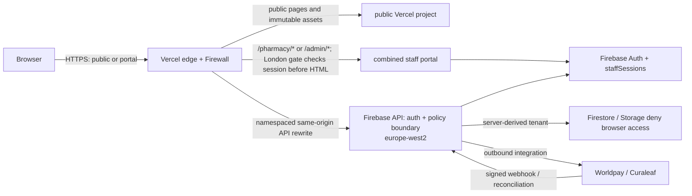

# Security data flow

Session establishment sends a recent Firebase ID token, App Check token, and CSRF token to the API. The API verifies email, TOTP, role, surface, organisation, and active staff state; creates an eight-hour session cookie; stores only its hash in `staffSessions`; and the browser signs out of Firebase. Subsequent requests use the host-only HttpOnly cookie. Unsafe requests also require the matching CSRF header and valid request-origin evidence.

The Pharmacy Overview receives a purpose-built aggregate response. Record opening causes a separate authorised detail read; summary cards never load full patient or order collections.
