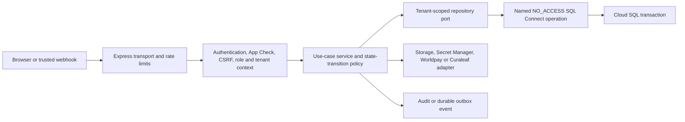

# API rewrite plan: Firestore to SQL Connect

Status: implementation plan; no traffic is served from this folder.

## 1. Current-state evidence

The migration surface is larger than `services/api/src/repository.ts`:

- `services/api/src/app.ts` is 4,565 lines with 105 Express route declarations.
- 24 API modules import Firestore or Firestore-specific types directly.
- `services/api/src/functions.ts` exports the HTTP function plus 12 scheduled or
  task-driven workers.
- `api/page-gate.ts` independently reads `staffSessions`, `staffUsers`, and audit
  records from Firestore before protected HTML is returned.
- Firestore transaction and denormalised-document assumptions are embedded in
  intake, orders, placement, payment, finance, notification, and integration
  workflows.

This means the rewrite is an application-architecture migration, not a database
driver replacement.

## 2. Target request path

Each layer has one responsibility:

| Layer | Responsibility | Must not do |
| --- | --- | --- |
| Transport | Parse HTTP, validate input, shape the existing response contract | Query SQL or decide tenant ownership |
| Security | Verify App Check/session/token, surface, role, staff status, CSRF/origin and derive request context | Trust tenant IDs from the request |
| Application | Run one named use case, enforce state transitions and transaction boundary | Depend on Express or generated SDK response shapes |
| Domain | Pure rules for eligibility, orders, payments, placement and fulfilment | Perform network/database calls |
| Repository | Execute a named, tenant-filtered read or transaction and map database rows | Expose generic table CRUD or accept an optional tenant |
| Provider adapter | Isolate Storage, Secret Manager, Worldpay and Curaleaf | Persist clinical/financial state outside the use case |
| Worker | Claim durable work idempotently and invoke the same application service | Reimplement route business rules |

Dependency direction is inward: transport and infrastructure depend on
application/domain contracts; domain code does not import Firebase, Express, or
provider SDKs.

## 3. Server SQL Connect design

### Connector

Add a dedicated server connector under `dataconnect/connectors/server` only when
the foundation implementation starts.

- Every operation is named after a use case, not a table action.
- Every operation is omitted from public/client SDK configuration.
- Every operation has `@auth(level: NO_ACCESS)` explicitly, even though this is
  the default.
- Multi-row state changes use `@transaction` and embedded `@check` conditions.
- Sensitive prerequisite queries use `@redact` so intermediate rows are never
  returned.
- List operations have fixed pagination and maximum limits.
- Mutations return the smallest response needed by the API contract.

The Firebase Admin SDK can run with unrestricted database privileges and ignore
operation authorization directives when it is not impersonating a user. For
that reason, `NO_ACCESS` protects the connector from clients but is not the
tenant boundary inside the API. The tenant boundary is enforced twice:

1. an immutable `RequestContext` derived from the verified session; and
2. an organisation predicate in every tenant-owned SQL operation, including
   nested lookups and mutation preconditions.

No request-path module may call `executeGraphql`, `insert`, `upsert`, or another
generic bulk method directly. Those APIs are reserved for reviewed migration
tools. Runtime code uses generated named operations through repository adapters.

### Repository scopes

Repository methods take one of two explicit scopes:

- `TenantScope`: organisation ID, staff UID, pharmacy role, surface, session
  hash and request ID. It can only be built by security middleware.
- `PlatformScope`: HHH administrator UID, admin surface, session hash and request
  ID. Cross-tenant access also requires a use-case-specific target organisation
  and an audit reason.

There is no `organisationId?: string` repository API. A pharmacy miss, including
a cross-tenant ID probe, returns the same `404` result and response shape as a
missing record.

## 4. Security controls to preserve or add

### Before any use case

- Exact production hostname/surface and allowed-origin checks.
- App Check where currently required.
- Firebase session-cookie verification with revocation checking.
- Verified email and TOTP second factor.
- Active `StaffUser` SQL row matching token UID, role and organisation claims.
- Active `StaffSession` SQL row matching the cookie hash, surface, role, tenant,
  user-agent hash, idle expiry, absolute expiry and revocation state.
- Strict CSRF cookie/header equality for unsafe cookie-authenticated methods.
- Existing per-IP, token, user and provider rate limits.

### For every tenant read

- Tenant filter is part of the initial query, not an after-the-fact comparison.
- Joined tenant-owned rows must agree on organisation ID.
- Pagination uses opaque cursors, deterministic ordering and hard limits.
- Search and relation traversal cannot broaden the tenant predicate.
- Clinical, identity, financial, staff and audit data is returned by allowlist,
  not row spreading.

### For every mutation

- Zod validates the transport input; the domain service validates the state
  transition.
- The verified actor and tenant are injected server-side.
- Mutable aggregates use optimistic concurrency (`expectedVersion`).
- Money and quantities are non-negative integers; payment currency is fixed to
  the order currency.
- Financial, assignment, placement and fulfilment transitions are atomic.
- Provider/webhook/payment/notification operations require a unique idempotency
  key and replay the prior safe result.
- High-risk mutations create their audit/event row in the same transaction.
- Retained records are archived or transitioned; runtime connectors expose no
  hard delete for patients, prescriptions, paid orders, payments or audit data.

### Provider and file boundaries

- SQL stores Secret Manager resource names and masked metadata, never secrets.
- Private prescription objects remain in Cloud Storage.
- Upload completion verifies tenant-bound path, content type, size and object
  metadata before changing SQL state.
- Download URLs are purpose-bound, short-lived and created only after a
  tenant-scoped SQL lookup.
- Provider request/response JSON is allowlisted or redacted before persistence;
  authorization headers, full payment instrument data and raw secrets are never
  stored or logged.

## 5. Required schema hardening before route work

The deployed relational model is the correct domain baseline, but the API plan
requires one reviewed follow-up migration before runtime operations are added:

- Add optimistic `version: Int! @default(value: 1)` fields to mutable aggregates:
  `Organisation`, `StaffUser`, `Patient`, `OrderDraft`, `Order`, `Payment`,
  `IntegrationConnection`, `IntegrationOperation`, `Shipment`, `GoodsReceipt`,
  `NotificationOutbox`, and `StaffTask`. Keep `EligibilitySubmission.assignmentVersion`
  for allocation and add a general `version` only if other fields mutate independently.
- Add `MigrationLedger` with source collection/document ID, target table/row ID,
  transform version, source hash, outcome, attempt count and timestamps.
- Add `MigrationOutbox` for ordered, idempotent Firestore-to-SQL deltas during shadow
  mode and reverse-replay sync during the post-cutover grace window.
- Add explicit uniqueness where the API depends on business identity, after the
  inventory proves legacy data will not collide.
- Review `Any` payload columns and document an allowlisted schema and maximum
  size for each. `Any` is not permission to store arbitrary request bodies.

No destructive schema migration is applied without a reviewed diff, backup,
row-count evidence and an explicit rollback decision.

## 6. Authentication and page-gate migration

The page gate is part of this project even though it lives in `api/page-gate.ts`.
It must move in the same slice as `StaffUser` and `StaffSession`.

Target behaviour:

1. The page gate verifies the Firebase session cookie and requested hostname/
   surface as it does now.
2. It executes one generated `GetPortalAdmission` server operation using the
   exact session hash and UID.
3. The operation returns only active/revocation/expiry, role, organisation and
   allowed surface fields; it cannot list staff or sessions.
4. The gate compares Auth claims, SQL staff scope and SQL session scope before
   returning protected HTML.
5. Session creation, touch, revocation and staff disablement write SQL. Disabling
   a staff user revokes their sessions in the same use case.
6. Session touches (`lastActivityAt`, `idleExpiresAt`) are debounced to a 5-minute
   interval (`SESSION_TOUCH_INTERVAL_MS`) to eliminate write-lock contention across
   concurrent asset and page requests.
7. Page-gate security events use the same audit sink and contain no email or PII.

During shadowing, Firestore remains authoritative and SQL admission is compared
without affecting the response. Cutover occurs only after expiry, revocation,
role, tenant and disabled-user parity tests pass.

## 7. Implementation phases

### Phase A — foundation, no traffic

- Apply the additive schema-hardening migration.
- Create the server-only connector and generated Admin SDK.
- Bootstrap the new package, configuration and emulator wiring.
- Implement request/platform/tenant scope types and repository error mapping.
- Add a server-side domain feature-flag registry.
- Add test builders using synthetic tenants and patients only.

Exit: build and emulator tests pass; no HTTP route is exported; no production
write path exists.

### Phase B — identity, tenancy and audit

- Implement organisation, staff, session and audit repositories.
- Port session creation/touch/revocation and the page gate in shadow mode.
- Port setup/preferences only after identity parity is stable.

Exit: all negative authentication and cross-surface tests pass; session parity is
stable; an emergency flag restores Firestore admission.

### Phase C — public directory and intake

- Port directory profiles and token-hash referral resolution.
- Port eligibility submission, consent, conditions and assignment history.
- Replace allocation overlays with the canonical relational assignment state.

Exit: token enumeration, replay, rate-limit, assignment-version and tenant
activation tests pass; migrated counts and status distributions reconcile.

### Phase D — patients and prescriptions

- Port patient activation, hashed identity deduplication and prescribers.
- Port prescription metadata and private Storage lifecycle.
- Validate Storage file paths against tenant ownership before issuing signed URLs.
- Preserve current API response contracts through explicit mappers.

Exit: cross-tenant file and patient tests pass; no signed URL escapes tenant or
TTL limits; duplicate identities are quarantined rather than merged silently.

### Phase E — orders and placement

- Port drafts, orders, prescriptions, lines and placement events.
- **Migration filter policy**: Only migrate orders placed from the primary pharmacy
  that have been successfully sent to Curaleaf (active supplier purchase order / placement).
  All abandoned drafts, rejected, cancelled, and test orders from non-production /
  training accounts are excluded from the PostgreSQL transfer and logged as skipped in
  the `MigrationLedger`.
- Replace embedded Firestore maps with relational projections.
- Enforce expected versions and legal state transitions transactionally.

Exit: totals, prescription expiry, handout, cancellation, substitution and
placement replay tests pass; sampled Firestore/SQL projections match.

### Phase F — payments, refunds and webhooks

- Port payment sessions, receipts, reconciliation, refunds and webhook inbox.
- Resolve Worldpay webhook tenant and payment records strictly from the payload
  `transactionReference` lookup in SQL, never trusting client URL parameters.
- Verify Worldpay state independently before marking payment success.
- Make every provider event and hosted-payment request idempotent.

Exit: amount/currency/order/tenant matching, duplicate webhook, rollback and
reconciliation tests pass. This phase requires the strongest review.

### Phase G — integrations, fulfilment and workers

- Port Curaleaf connections/operations, shipments, goods receipts, dispense and
  fee events, notifications, tasks, reporting and all background workers.
- Manage worker concurrency via PostgreSQL row-level advisory locks or atomic
  `IntegrationOperation` state updates with lease timestamps.
- Workers claim SQL work with leases or status/version preconditions and call
  the same application services as HTTP routes.

Exit: retries cannot duplicate supplier orders, notifications, fees or receipts;
worker concurrency and poison-event handling are tested.

### Phase H — retirement

- Disable Firestore writes by domain, retain read-only rollback evidence, and
  monitor the agreed rollback window.
- Remove Firestore imports, indexes, scheduled paths and IAM only after sign-off.
- Archive migration ledgers and reconciliation evidence under the approved
  retention schedule.

## 8. Feature flags, shadowing and rollback

Use server-side flags per bounded context:

- read mode: `firestore`, `sql-shadow`, or `sql`;
- write mode: `firestore`, `firestore-outbox`, or `sql`.

`sql-shadow` returns the Firestore result to the caller and compares only
privacy-safe projections: IDs/hashes, counts, status, tenant ownership, integer
totals and timestamps. Raw PII is not written to comparison logs.

Do not perform uncoordinated best-effort dual writes. In `firestore-outbox` mode,
the authoritative Firestore transaction records a durable migration event; an
idempotent worker applies it to SQL and records the result. Before a domain moves
to SQL writes, pause briefly, drain the outbox, reconcile, switch the flag and
record the cutover checkpoint.

### Reverse replay grace period

For the first 48 hours following cutover to live SQL writes, an outbox worker
pipes SQL mutations back to Firestore. If an unrecoverable failure occurs, traffic
can revert to Firestore with zero data loss after executing a reverse delta catch-up.
Once the grace window expires and parity is confirmed, Firestore is permanently
frozen and retired.

## 9. Test gates

Every slice adds:

- contract tests proving existing status codes and response shapes remain stable;
- emulator repository tests for transaction and constraint behaviour;
- negative auth tests for anonymous, missing App Check, unverified email, no
  TOTP, invalid/expired/revoked session, disabled staff and wrong surface;
- cross-tenant tests by ID, nested relation, filter, pagination, sort, bulk input,
  file path and error/timing shape;
- state-machine and optimistic-conflict tests;
- idempotency and concurrent-request tests;
- provider failure/timeout/retry tests where applicable;
- migration dry-run, resume, duplicate, orphan and quarantine tests;
- structured-log tests proving secrets and raw PII are absent.

Production promotion additionally requires backup restore, load/concurrency,
UAT, DPIA/compliance, external penetration testing and rollback rehearsal.

## 10. Definition of complete

The API rewrite is complete only when:

- all 105 current route declarations and 12 workers are either mapped to SQL,
  explicitly retired, or documented as non-persistent;
- `api/page-gate.ts` has no Firestore dependency;
- production API code has no Firestore imports or generic SQL execution calls;
- connector operations are server-only, least-data and reviewed;
- reconciliation is clean for every migrated domain;
- Firestore rollback/retention requirements are satisfied; and
- security, compliance and operational go-live gates are signed off.

## Firebase implementation references

- [Use the Admin SDK with SQL Connect](https://firebase.google.com/docs/sql-connect/admin-sdk)
- [Secure SQL Connect with authorization and attestation](https://firebase.google.com/docs/sql-connect/authorization-and-security)
- [Firebase Admin Data Connect API reference](https://firebase.google.com/docs/reference/admin/node/firebase-admin.data-connect.dataconnect)
