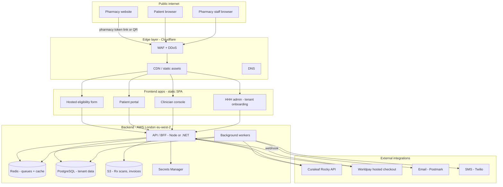
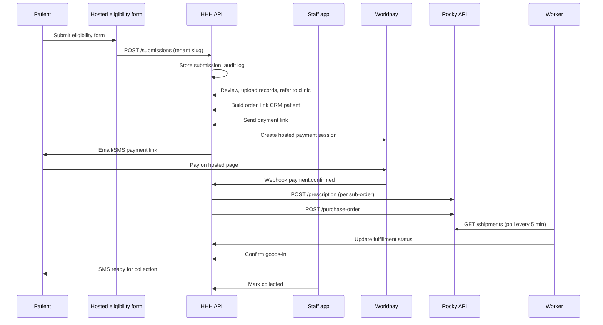
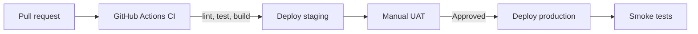

# HHH × Curaleaf — Production Architecture & Pharmacy Onboarding

> **Architecture decision update:** The eligibility form is now a centrally hosted HHH application using pharmacy-token link-out URLs and QR codes only. It is not embedded or iframed on pharmacy websites. See `ADR-hosted-form-link-out.md`; that decision supersedes older embed sections in this document.
>
> **Operator identity:** HHH (Holistic Health Hub) is the platform brand used by Healius Consulting. The exact registered legal entity behind that business name, company number and registered office remain a pre-live confirmation gate. Legal documents and regulated accounts must use that verified entity, not an assumed “HHH Ltd”.
>
> **Working payment assumption (14 July 2026):** Each pharmacy controls its prescription and delivery prices and connects its own approved Worldpay merchant account. Online patient funds settle directly to that pharmacy. Pharmacy-managed EPOS/cash also remains available. HHH does not take a percentage of prescription sales; it charges the pharmacy a separate platform subscription fee. The Worldpay connection model remains blocked for live use until Worldpay confirms the supported per-pharmacy merchant onboarding and direct-settlement route.
>
> **Working onboarding assumption (14 July 2026):** Holistic Health Hub receives pharmacy-attributed eligibility enquiries. Shaylen performs and logs the patient call, then records the final programme-onboarding approval or decline. Approval releases the patient only to the attributed pharmacy's CRM. This is an administrative programme gate: a doctor must still prescribe and the pharmacy must validate the prescription and complete its professional checks before HHH can transmit an order to Curaleaf.

**Status:** Architecture proposal for production build  
**Audience:** Engineering, operations, compliance  
**Related docs:** `uk-compliance-register.md` (master labelled checklist), `project-manager-playbook.md`, `specs/README.md`, `full_project_breakdown.md`, `Rocky_API_Technical_Requirements_v1.5.docx`

### Requirement labels (UK guidance)

All requirements in this document use the labels defined in **`uk-compliance-register.md`**:

| Label | Meaning |
|-------|---------|
| **REQ-UK** | Required by UK law (UK GDPR, DPA 2018, etc.) |
| **REQ-ICO** | Required ICO accountability measure |
| **REQ-GPHC** | Required under GPhC pharmacy standards (tenant + platform support) |
| **REQ-LEGAL** | Required legal document — solicitor / DPO advisor |
| **REQ-PLATFORM** | Required secure platform implementation — Developer |
| **REQ-PM** / **REQ-DEV** | Required action owner |
| **REC-UK** | Recommended UK best practice |
| **OPEN** | Decision outstanding — **PRE-BUILD** |
| **PRE-LIVE** | Must be complete before first live patient |

---

## 1. Executive summary

The production platform is a **multi-tenant SaaS** serving independent pharmacy partners. Each pharmacy is an isolated **tenant** with its own branding, enabled modules, referral token, staff accounts, pricing and delivery configuration, platform subscription fee, Worldpay merchant connection and Curaleaf Rocky account mapping.

Three user-facing surfaces:

| Surface | URL pattern | Embedded on pharmacy site? |
|---------|-------------|----------------------------|
| **Hosted eligibility form** | `eligibility.hhh.health/?token={referral-token}` | No — pharmacy links/buttons and QR codes open it |
| **Patient portal** | `portal.hhh.health/p/{slug}` or `{slug}.patient.hhh.health` | Optional — subdomain or path |
| **Clinician console** | `app.hhh.health` | No — separate authenticated app |

All patient and prescription data stays **server-side**. The browser never holds Rocky API keys, never stores card data (Worldpay hosted checkout), and never receives long-lived access to prescription scans (signed URLs with short TTL).

**Hosting principle:** **REQ-UK** — UK/EU data residency for anything storing or processing special-category health data (UK GDPR Article 9 — [ICO special category guidance](https://ico.org.uk/for-organisations/uk-gdpr-guidance-and-resources/lawful-basis/a-guide-to-lawful-basis/special-category-data/)).

### 1.1 UK regulatory touchpoints (platform scope)

| Regime | Platform obligation | Pharmacy tenant obligation |
|--------|----------------------|---------------------------|
| **UK GDPR + DPA 2018** | Processor/controller duties per DPA; privacy by design; breach support | Controller duties if pharmacy is controller; RP oversight |
| **ICO** | DPIA, ROPA, sub-processor DPAs, breach process — see register | ICO registration; pharmacy privacy notice to patients |
| **GPhC Standards** | Display GPhC number, SP name and pharmacy address on hosted form/portal | CBPM risk assessment, CD storage, prescription verification |
| **GPhC distance selling** | Hosted eligibility form must not enable uncontrolled medicine ordering | Distance-selling risk assessment signed off |
| **PECR** | Cookie consent if non-essential cookies; lawful SMS/email rails | Marketing consent separate from clinical consent |
| **PCI DSS** | **REQ-UK** — hosted checkout only; no card data on HHH systems; tenant-safe payment attribution and webhook reconciliation | Pharmacy owns its merchant relationship and direct-settlement account |
| **Misuse of Drugs / HMR** | Audit trail for supply chain; no platform bypass of Rx gate | CD register, secure storage, valid prescription check |

Full labelled checklist: **`uk-compliance-register.md`**.

---

## 2. High-level system diagram



---

## 3. Application architecture

### 3.1 Monorepo structure (recommended)

```
hhh-platform/
├── apps/
│   ├── eligibility/           # Centrally hosted, token-attributed public form
│   ├── patient-portal/        # Patient-facing SPA
│   ├── clinician-app/         # Staff console (current prototype → production)
│   └── admin-portal/          # HHH internal: tenant onboarding, support
├── packages/
│   ├── api-client/            # Typed API client shared across apps
│   ├── ui/                    # Shared design system components
│   └── types/                 # Shared TypeScript schemas
├── services/
│   ├── api/                   # REST/GraphQL BFF
│   └── worker/                # Shipment polling, notifications, retries
└── infra/                     # Terraform or Pulumi (IaC)
```

The current prototype (`src/`) maps to `apps/clinician-app` plus shared packages. Split before production — do not ship one bundle for all surfaces.

### 3.2 Backend API (BFF pattern)

Single API service that:

- **REQ-PLATFORM / REQ-DEV:** Authenticates staff (JWT + **REQ-ICO MFA**) and patients (magic link / SMS OTP)
- **REQ-PLATFORM / REQ-DEV:** Enforces **tenant isolation** on every query (`pharmacy_id` from auth context)
- **REQ-PLATFORM / REQ-DEV:** Proxies Curaleaf Rocky API using per-tenant credentials from Secrets Manager
- **REQ-PLATFORM / REQ-DEV:** Issues short-lived signed URLs for prescription scan download
- **REQ-UK / REQ-DEV:** Creates Worldpay payment sessions; verifies webhooks — **hosted checkout only**
- **REQ-PLATFORM / REQ-DEV:** Enforces the HHH onboarding decision before a patient can enter a pharmacy ordering workflow; records named approver, time and reason
- **REQ-GPHC / REQ-DEV:** Blocks payment and Curaleaf submission until the HHH-approved patient has a named prescriber, attached prescription and pharmacy verification
- **REQ-ICO / REQ-DEV:** Writes audit logs for every read/write of patient data (supports Art. 15 access requests)
- **REQ-PLATFORM / REQ-DEV:** Validates and supports revocation/rotation of pharmacy referral tokens; rate-limits public form routes
- **REQ-UK / REQ-DEV:** Captures granular **explicit consent** on eligibility submissions (care vs marketing separate)
- **REQ-GPHC / REQ-DEV:** Surfaces pharmacy GPhC number, superintendent pharmacist, and address on tenant surfaces

**Do not** expose Rocky endpoints directly to the browser.

### 3.3 Background workers

Separate worker process (same codebase, different entrypoint):

| Job | Schedule / trigger | Purpose |
|-----|-------------------|---------|
| Shipment poller | Every 5 min per active order | `GET /shipments` — Rocky has no webhooks |
| Payment reconciliation | On webhook + hourly sweep | Match Worldpay refs to sub-orders |
| Notification dispatcher | Event-driven | Payment link, paid confirmation, ready for collection |
| Draft order expiry | Daily | Clear stale draft orders (>24h per TRD F-26) |
| Credential health check | Daily | Test Rocky auth per tenant; alert on failure |

Queue: **Redis + BullMQ** (simple start) or **AWS SQS** (scale).

### 3.4 Data model (core entities)

```
organisations (pharmacy tenants)
├── id, slug, name, branding, status
├── website_domains[]
├── referral_token_hash, referral_token_status
├── modules, branding
├── worldpay_merchant_reference, worldpay_connection_status
├── collection_address, collection_place_name
└── rocky_credentials_ref → Secrets Manager

staff_users
├── organisation_id, email, role (counter | manager | admin)
└── mfa_enabled

patients (CRM)
├── organisation_id, name, email, mobile, address
└── status, interactions[] (audit timeline)

eligibility_submissions
├── organisation_id, patient fields, consent flags
└── HHH onboarding status (New → Under HHH review → Approved / Declined), reviewer and immutable decision audit

orders
├── organisation_id, patient_id
└── prescriptions[] (sub-orders)
    ├── scan_s3_key, prescriber, line_items[]
    ├── payment { status, amount, worldpay_ref }
    ├── rocky { prescription_ref, po_ref }
    └── fulfillment { status, tracking, ready_at, collected_at }

audit_logs (append-only)
├── actor, action, resource_type, resource_id, ip, timestamp
```

PostgreSQL with **row-level security (RLS)** policies keyed on `organisation_id`.

---

## 4. Security & confidentiality

### 4.1 Data classification

| Class | UK basis | Examples | Storage | Access |
|-------|----------|----------|---------|--------|
| **Special category (Art. 9)** | **REQ-UK** — [ICO Art. 9](https://ico.org.uk/for-organisations/uk-gdpr-guidance-and-resources/lawful-basis/a-guide-to-lawful-basis/special-category-data/) | Medical condition, prescription scans, Rx line items | Encrypted DB + private S3 | Staff RBAC; patient sees own data only |
| **Personal data** | **REQ-UK** — UK GDPR | Name, email, mobile, address | Encrypted DB | Tenant-scoped |
| **Financial** | **REQ-UK** — PCI avoided via hosted checkout | Payment refs, amounts only — **no PAN/CVV** | DB | Staff + patient (own orders) |
| **Secrets** | **REQ-PLATFORM** | Rocky API keys | Secrets Manager | API service only |
| **Public** | — | Product formulary (non-patient-linked) | Cache | Authenticated staff |

### 4.2 Authentication

| User | Method | Session |
|------|--------|---------|
| **Staff** | Email + password + **MFA (TOTP)** | HttpOnly cookie, 8h TTL, refresh token |
| **Patient** | Magic link or SMS OTP | HttpOnly cookie, 1h TTL, `SameSite=Lax` unless a reviewed cross-site flow requires otherwise |
| **Admin (HHH)** | SSO + MFA | Separate admin auth realm |

Roles: `counter_staff`, `pharmacist`, `manager`, `org_admin`, `hhh_superadmin`.

### 4.3 Centrally hosted eligibility form (**REQ-PLATFORM**)

**REQ-GPHC:** The public surface is an eligibility pre-screen only—not an online medicine ordering basket ([GPhC distance selling guidance](https://www.pharmacyregulation.org/guidance/standards-and-guidance/guidance-for-registered-pharmacies-providing-pharmacy-services-at-a-distance-including-on-the-internet)).

Each pharmacy receives a managed link and matching QR code:

```text
https://eligibility.hhh.health/?token={revocable-pharmacy-token}
```

The pharmacy may design its own webpage, leaflet, button or poster, but it links out to the HHH-hosted form. HHH does not provide form HTML or an iframe snippet. The API resolves the token to the public pharmacy identity before rendering; invalid, paused or revoked tokens fail closed and cannot accept data.

The hosted form serves security headers including:

```http
Content-Security-Policy: default-src 'self'; frame-ancestors 'none'; form-action 'self'; ...
Referrer-Policy: strict-origin-when-cross-origin
X-Content-Type-Options: nosniff
Permissions-Policy: camera=(), microphone=(), geolocation=(), payment=()
Strict-Transport-Security: max-age=31536000; includeSubDomains
```

Public routes are protected by TLS, rate limiting, bot controls, strict schema validation, CSRF protections appropriate to the architecture, security logging and token rotation. Referral tokens provide attribution, not staff authentication or authorisation.

### 4.4 Encryption

- **In transit:** TLS 1.2+ everywhere (Cloudflare → origin)
- **At rest:** RDS encryption (AES-256), S3 SSE-KMS, Redis encryption in transit
- **Prescription scans:** S3 private bucket, no public ACLs, signed URL max 15 min
- **Backups:** Encrypted, UK region, 30-day retention minimum

### 4.5 UK compliance checklist (**PRE-LIVE**)

Cross-reference: **`uk-compliance-register.md`** (IDs in parentheses).

#### Legal & ICO accountability
- [ ] **REQ-ICO (G-01)** DPIA completed and signed off — mandatory for special category + online access ([ICO DPIA guidance](https://ico.org.uk/for-organisations/uk-gdpr-guidance-and-resources/accountability-and-governance/guide-to-accountability-and-governance/data-protection-impact-assessments/))
- [ ] **REQ-ICO (G-02)** Record of Processing Activities (ROPA) maintained
- [ ] **REQ-LEGAL (C-03, C-04)** Partner agreement + DPA templates approved by solicitor
- [ ] **REQ-UK (G-06, G-07)** DPA signed: each pharmacy + all sub-processors (AWS, Worldpay, Twilio, Postmark, Curaleaf)
- [ ] **REQ-UK (G-03, G-04)** Privacy notices published; eligibility **explicit consent** wording live
- [ ] **REQ-ICO (G-05)** Appropriate Policy Document (if DPA 2018 Sch. 1 Art. 9 condition used)
- [ ] **REQ-UK (C-01, C-05)** Healius Consulting operator legal identity verified and ICO registration/fee complete in that entity's name if advised
- [ ] **REQ-ICO (G-08)** Data retention policy documented **and** automated deletion jobs deployed
- [ ] **REQ-ICO (G-09)** Personal data breach procedure (72h ICO notification where required — Arts. 33–34)
- [ ] **REQ-ICO (G-10)** Individual rights request process (access, erasure, rectification)
- [ ] **REQ-UK (G-11, G-12)** PECR: cookie consent (if needed); lawful SMS/email for notifications

#### GPhC & pharmacy professional (per tenant)
- [ ] **REQ-GPHC (P-01–P-03)** GPhC number, superintendent pharmacist and address displayed on hosted form/portal
- [ ] **REQ-GPHC (P-04)** Pharmacy CBPM / distance-selling risk assessment on file
- [ ] **REQ-GPHC (P-05)** Staff training + confidentiality acknowledgement recorded
- [ ] **REQ-GPHC (P-06)** Pharmacy professional indemnity confirmed

#### Platform technical
- [ ] **REQ-PLATFORM (T-01–T-14)** UK hosting, encryption, tenant isolation, MFA, audit logs, hosted-form protection, admin access controls and no card data
- [ ] **REC-UK (G-13, T-10)** Cyber Essentials; WCAG 2.2 AA patient surfaces

---

## 5. Hosting recommendations

### 5.1 Recommended stack (production)

| Layer | Service | Region | Rationale |
|-------|---------|--------|-----------|
| **DNS + WAF + CDN** | Cloudflare Pro | Global edge, origin in UK | DDoS, bot protection, SSL, rate limiting |
| **Frontend (SPAs)** | Cloudflare Pages or AWS S3 + CloudFront | Assets global; no PHI in bundles | Fast, cheap, easy CI deploy |
| **API** | AWS ECS Fargate or App Runner | **eu-west-2 (London)** | UK data residency, auto-scale |
| **Workers** | AWS ECS Fargate (same cluster) | **eu-west-2** | Co-located with API and DB |
| **Database** | AWS RDS PostgreSQL 16 | **eu-west-2** | RLS, automated backups, Multi-AZ for prod |
| **Cache / queue** | AWS ElastiCache Redis | **eu-west-2** | Job queues, formulary cache (15 min TTL) |
| **File storage** | AWS S3 | **eu-west-2** | Rx scans, invoice PDFs |
| **Secrets** | AWS Secrets Manager | **eu-west-2** | Per-tenant Rocky credentials |
| **Email** | Postmark | EU processing available | Transactional email, good deliverability |
| **SMS** | Twilio | Configure UK routing | Payment links, ready-for-collection |
| **Payments** | Worldpay | Hosted checkout | PCI scope stays with Worldpay |
| **Monitoring** | Sentry + CloudWatch + PagerDuty | — | Errors, uptime, alerts |
| **CI/CD** | GitHub Actions | — | Deploy to staging → prod with approval gate |

### 5.2 Domain structure

| Domain | Purpose |
|--------|---------|
| `hhh.health` | Marketing / corporate |
| `eligibility.hhh.health` | Centrally hosted eligibility form |
| `portal.hhh.health` | Patient portal |
| `app.hhh.health` | Clinician console |
| `admin.hhh.health` | HHH internal admin (IP-restricted or VPN) |
| `api.hhh.health` | API (not public-facing docs; staff/patient apps call this) |

Optional per-pharmacy white-label:

| Domain | Purpose |
|--------|---------|
| `prescriptions.{pharmacy-domain}.co.uk` | CNAME → `portal.hhh.health` (tenant routing by hostname) |

### 5.3 Environments

| Environment | Purpose | Data |
|-------------|---------|------|
| **dev** | Local + shared dev API | Synthetic seed data only |
| **staging** | Pre-prod QA, pharmacy UAT | Anonymised test data; Rocky sandbox credentials |
| **prod** | Live | Real patient data |

Each environment: separate AWS account or at minimum separate VPC, DB, and secrets namespace.

### 5.4 Alternative: simpler start (still UK-compliant)

If AWS ops overhead is too much early on:

| Layer | Alternative |
|-------|-------------|
| API + workers | **Railway** or **Fly.io** (London region) |
| Database | **Supabase** (London) or Railway Postgres |
| Files | **Cloudflare R2** (EU jurisdiction) |
| Frontend | Cloudflare Pages |

Migrate to AWS when you hit ~10 pharmacies or need formal NHS-adjacent audit requirements.

### 5.5 Rough monthly cost estimate (single region, early scale)

| Item | ~Cost (5 pharmacies, low traffic) |
|------|-----------------------------------|
| Cloudflare Pro | £20 |
| AWS (RDS db.t4g.small, ECS 2 tasks, S3, Redis) | £150–250 |
| Postmark + Twilio | £30–80 (volume-dependent) |
| Sentry | £0–26 |
| **Total infra** | **~£200–400/mo** |

Scales with pharmacy count, shipment polling volume, and SMS sends—not with hosted-form page views served from the CDN.

---

## 6. Integration architecture



| Integration | Direction | Auth | Notes |
|-------------|-----------|------|-------|
| Rocky `GET /products` | API → Rocky | Per-tenant API key | Cache 15 min |
| Rocky `POST /prescription` | API → Rocky | Per-tenant | Sequential per TRD F-25 |
| Rocky `POST /purchase-order` | API → Rocky | Per-tenant | Gated on payment + scan |
| Rocky `GET /shipments` | Worker → Rocky | Per-tenant | Poll; no webhooks |
| Worldpay | API ↔ Worldpay | One connected merchant relationship per pharmacy | Hosted checkout only; tenant attribution, verified webhooks and direct settlement to the pharmacy |
| Postmark / Twilio | Worker → provider | API keys | Templates per tenant branding |

---

## 7. Pharmacy onboarding — full playbook

### Phase 0 — Commercial & legal (**PRE-LIVE** — before any technical work)

| Step | Label | Owner | Output |
|------|-------|-------|--------|
| 0.1 | **REQ-LEGAL (C-03)** | Project Manager | Signed pharmacy partner agreement |
| 0.2 | **REQ-UK (C-01, G-06, G-07)** | Solicitor + Project Manager | Operator legal identity verified; DPA signed (pharmacy ↔ verified Healius legal entity; operator ↔ subprocessors) |
| 0.3 | **REQ-UK** | Pharmacy / Project Manager | Pharmacy ICO registration confirmed; RP contact named |
| 0.4 | **REQ-LEGAL (C-07) OPEN** | Solicitor | Data controller/processor roles documented |
| 0.5 | **REQ-ICO (G-01)** | Advisor + Developer input | Platform DPIA signed off |
| 0.6 | **REQ-ICO (G-02)** | Project Manager + advisor | ROPA completed |
| 0.7 | **REQ-UK (G-03, G-04)** | Solicitor + Developer | Privacy notices + consent wording live on the hosted eligibility form |
| 0.8 | **REQ-GPHC (P-04, P-06)** | Pharmacy / Project Manager | CBPM risk assessment + indemnity on file |
| 0.9 | **REQ-PM (I-04)** | Pharmacy → Project Manager | Curaleaf Rocky API credentials requested |
| 0.10 | **OPEN (I-01, I-06)** | Project Manager + solicitor | Worldpay/legal approval for per-pharmacy merchant onboarding, direct settlement, refunds, chargebacks and reconciliation; agree the separate HHH subscription terms |

**Gate:** **PRE-LIVE** — No production tenant until **0.1** and **0.2** complete. No live patient data until **0.5** and **0.7** complete.

---

### Phase 1 — Tenant provisioning (**REQ-DEV** — HHH admin)

| Step | Label | Action | System |
|------|-------|--------|--------|
| 1.1 | **REQ-PLATFORM (T-12)** | Create organisation record | Admin portal |
| 1.2 | **REQ-PLATFORM** | Assign unique slug (e.g. `east-mids-lincoln`) | `organisations.slug` |
| 1.3 | **REQ-GPHC (P-01–P-03)** | Enter legal name, **GPhC number**, superintendent pharmacist, collection address | Admin portal |
| 1.4 | **REQ-PLATFORM** | Configure branding: logo, colours, portal name and enabled modules | S3 + DB |
| 1.5 | **REQ-PLATFORM (T-09)** | Store Rocky API credentials | Secrets Manager: `rocky/{org_id}` |
| 1.6 | **REQ-UK (T-07, T-14)** | Pharmacy securely connects its approved Worldpay merchant; verify tenant attribution and direct settlement while keeping credentials server-side only | Verified merchant connection + encrypted server config |
| 1.7 | **REQ-UK (G-12)** | Notification templates — lawful care messages only; marketing separate | Template engine |
| 1.8 | **REQ-ICO / REQ-PLATFORM (T-04)** | Create staff admin; invite → **MFA** setup | Auth service |

**Output:** Tenant in `draft` status.

---

### Phase 2 — Hosted form attribution and content setup

| Step | Label | Action | Details |
|------|-------|--------|---------|
| 2.1 | **REQ-PM** | Pharmacy submits website domain(s) | Recorded for partner governance and content checks |
| 2.2 | **REQ-PLATFORM (T-06)** | Generate a unique revocable referral token | Stored against organisation; never used as staff authentication |
| 2.3 | **REQ-DEV** | Resolve token to approved public pharmacy details | Invalid/paused/revoked tokens fail closed |
| 2.4 | **REQ-PLATFORM (T-06)** | Test form attribution and API submission in staging | Submission retains immutable `organisation_id` |
| 2.5 | **REQ-PLATFORM (T-12)** | Generate hosted link, QR image and link-out content pack | Admin + pharmacy portal download |
| 2.6 | **REC-UK** | Optional patient portal CNAME | `prescriptions.{domain}` → `portal.hhh.health` |

**Gate:** **PRE-LIVE (GL-06)** — Public link is not issued for live use until token attribution, legal wording and staging submission have passed UAT.

---

### Phase 3 — Staff onboarding

| Step | Label | Action | Details |
|------|-------|--------|---------|
| 3.1 | **REQ-PM** | Invite staff users | Roles: counter / manager / pharmacist |
| 3.2 | **REQ-ICO (T-04)** | MFA on first login | TOTP required |
| 3.3 | **REQ-GPHC (P-05)** | 30-min training session | Referrals → Create order → Payment → Orders; CBPM awareness |
| 3.4 | **REQ-PM** | Quick-reference PDF / Loom | Three lawful patient notifications only |
| 3.5 | **REQ-GPHC / REQ-ICO** | Confidentiality acknowledgement | Logged in audit trail |

---

### Phase 4 — Staging UAT (pharmacy tests before go-live)

| Step | Test | Pass criteria |
|------|------|---------------|
| 4.1 | Pharmacy staging button opens HHH hosted form | Correct pharmacy branding and GPhC details render |
| 4.2 | Submit test eligibility enquiry | Appears in Referrals tab within 30s |
| 4.3 | Walk full referral flow | OCR upload → clinic refer → CRM confirmed |
| 4.4 | Build test order with formulary products | Margin warnings show; sub-order gating works |
| 4.5 | Send test payment link | Worldpay sandbox payment completes |
| 4.6 | Simulate Rocky submission | Sandbox PO ref returned (or mocked in staging) |
| 4.7 | Simulate goods-in + collection | Patient SMS fires; barcode displays |
| 4.8 | Verify tenant isolation | Staff cannot see other pharmacy data |
| 4.9 | Invalid/revoked token negative test | Form fails closed and accepts no health data |

**Gate:** **PRE-LIVE (GL-08)** — Pharmacy manager signs UAT checklist.

---

### Phase 5 — Go-live (**PRE-LIVE** — all GL-* gates in `uk-compliance-register.md` §2.6)

| Step | Label | Action | Details |
|------|-------|--------|---------|
| 5.1 | **REQ-PM** | Tenant `draft` → `active` | Admin portal — only after GL-01–GL-08 |
| 5.2 | **REQ-DEV (I-04)** | Rocky sandbox → production credentials | Secrets Manager |
| 5.3 | **REQ-DEV (I-05)** | Worldpay sandbox → live merchant | Config update |
| 5.4 | **REQ-PM** | Hosted form link and QR published | Pharmacy-specific URL only; no form code copied to pharmacy site |
| 5.5 | **REQ-DEV** | Monitor first 48h | Errors, webhooks, submissions |
| 5.6 | **REQ-PM** | Go-live confirmation to pharmacy | Support + ICO/GPhC complaint route if applicable |

---

### Phase 6 — Ongoing operations

| Cadence | Activity |
|---------|----------|
| **Daily** | Monitor API errors, failed webhooks, Rocky auth failures |
| **Weekly** | Review onboarding pipeline; check uncollected medication alerts |
| **Monthly** | Invoice reconciliation per pharmacy; review audit logs sample |
| **Quarterly** | Access review (staff accounts); dependency patch cycle |
| **Annually** | DPIA review; penetration test; DPA renewal check |

---

## 8. Admin portal capabilities (HHH internal)

The admin app supports onboarding and support without engineering involvement:

- Create / suspend / archive tenants
- Configure tenant branding and enabled modules
- Generate/rotate referral tokens, links, QR codes and link-out content packs
- Rotate Rocky credentials
- View cross-tenant patient attribution for authorised support, with minimum-necessary data and immutable access logs
- Never impersonate a pharmacy silently; any future support-session feature needs a visible reason, expiry and audit record
- View platform-wide metrics: active tenants, submissions/day, payment success rate
- Manage feature flags per tenant (e.g. auto-place on payment)

---

## 9. Deployment & CI/CD



| App | Deploy target | Trigger |
|-----|---------------|---------|
| eligibility, patient-portal, clinician-app | Cloudflare Pages | Merge to `main` → staging; tag `v*` → prod |
| api, worker | AWS ECS | Same pipeline; blue/green or rolling deploy |
| DB migrations | Flyway / Prisma migrate | Run before API deploy; backward-compatible only |

Secrets injected at runtime from AWS Secrets Manager — never in CI logs or env files in repo.

---

## 10. Rollout phasing (engineering)

Aligns product delivery with onboarding readiness:

| Phase | Build | Onboard pharmacies when |
|-------|-------|---------------------------|
| **P1 — Foundation** | API, auth, multi-tenant DB, admin portal, hosted eligibility form, token attribution | Ready for intake-only partners |
| **P2 — Clinical ops** | Clinician app (Referrals, Patients, CRM), audit logs | Referral workflow live |
| **P3 — Commerce** | Create order, Worldpay, Awaiting payment | Payment before order model |
| **P4 — Fulfillment** | Rocky integration, Orders tab, shipment polling, goods-in, collection | Full end-to-end |
| **P5 — Patient portal** | Magic-link login, payment, collection pass, repeat requests | Patient self-service |

Do not onboard to P4 flows until P4 is deployed — match pharmacy expectations to available features.

---

## 11. What pharmacies experience (one-page summary)

Give every new partner this summary:

1. **Sign** partner agreement and DPA  
2. **Provide** GPhC details, logo, preferred colours, website domain and staff emails
3. **Receive** the pharmacy-specific hosted eligibility link, QR and content pack
4. **Add** a normal link or button to the pharmacy website—no form code is installed
5. **Train** staff (30 min session + video)  
6. **UAT** on staging (half day)  
7. **Go live** — we monitor the first 48 hours  

They never install software or manage servers. Pharmacy managers connect an approved Worldpay merchant account, control their prescription and delivery prices, and accept the separate HHH platform subscription terms. HHH operates the integration but never receives patients' card details or a pharmacy's online-banking password.

---

## 12. Open decisions (**OPEN — PRE-BUILD**)

| # | Label | Decision | Options | Impact |
|---|-------|----------|---------|--------|
| 1 | **REQ-LEGAL (C-07)** | Data controller | Pharmacy vs HHH as controller | DPA, privacy policy, ICO, Art. 6/9 basis |
| 2 | **OPEN (I-01, I-06)** | Approve per-pharmacy Worldpay model | Each pharmacy connects its merchant account and receives patient funds directly; HHH subscription billing remains separate | Merchant onboarding, tenant attribution, reconciliation, VAT, PCI, refunds and chargebacks |
| 3 | **OPEN** | Patient portal URL | Shared `portal.hhh.health/p/{slug}` vs CNAME | DNS Phase 2 |
| 4 | **OPEN** | OCR / records upload | Build vs integrate | Referrals flow |
| 5 | **OPEN (I-02)** | Rocky PO model | Consolidated vs one PO per prescription (TRD §9 #14) | Order submission logic |
| 6 | **REQ-LEGAL** | Art. 9 condition per processing activity | Consent (hosted form) vs Art. 9(2)(h) health care (CRM/Rx) | Consent UI + Appropriate Policy Document |

---

## 13. UK documents still to produce (outside repo)

| Document | Label | Owner |
|----------|-------|-------|
| DPIA | **REQ-ICO (G-01)** | Advisor + Developer input |
| ROPA | **REQ-ICO (G-02)** | Project Manager + advisor |
| Privacy notices (patient, staff) | **REQ-UK (G-03)** | Solicitor |
| Eligibility consent wording | **REQ-UK (G-04)** | Solicitor; Developer implements |
| Appropriate Policy Document | **REQ-ICO (G-05)** | Solicitor (if Sch. 1 condition used) |
| Breach response runbook | **REQ-ICO (G-09)** | Project Manager + Developer |
| UAT sign-off template | **PRE-LIVE (GL-08)** | Project Manager |
| Pharmacy onboarding form | **REQ-PM** | Project Manager |

---

*Prepared for HHH platform production planning. All labelled requirements tracked in `uk-compliance-register.md`. Revise when ICO/GPhC guidance or Curaleaf TRD §9 items change.*
